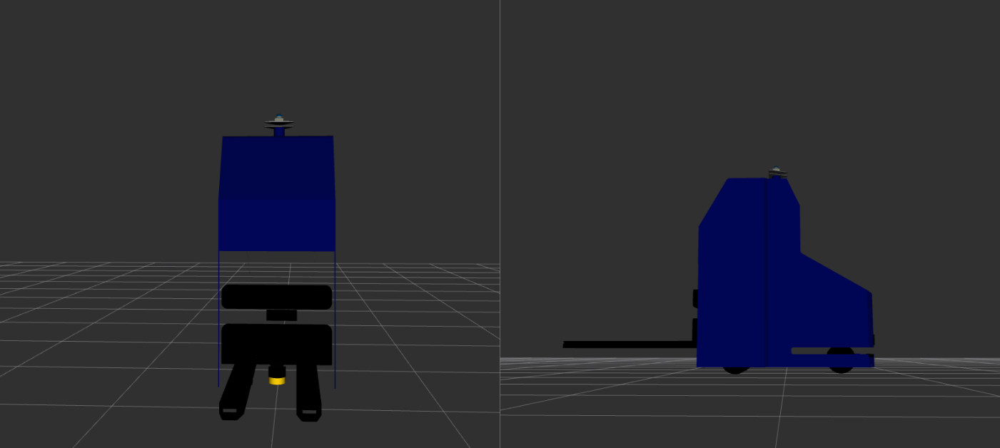
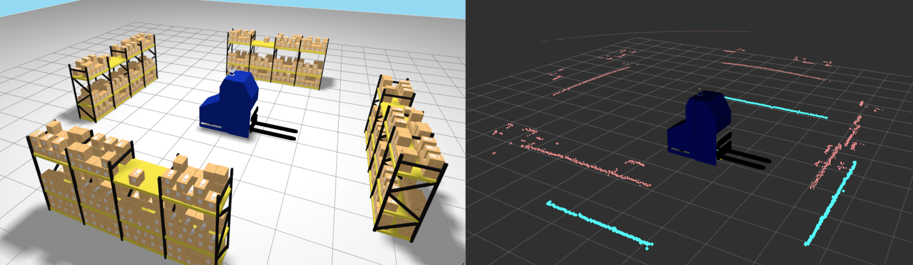

# robot_forki3

`robot_forki3` provides digital models of the three-steer Forki3 mobile robot, together with the configuration and launch files needed to visualize them in Gazebo and RViz. The package includes two models, `base`, which contains the mobile platform and simple fork, and `a`, which adds the camera and lidar sensor layout.



## Resources

### Common platform `urdf/common.xacro`

[`common.xacro`](urdf/common.xacro) defines the shared three-steer platform, including the chassis, wheel geometry, fork interface, and Gazebo plugins. Both robot models include this file before adding their own equipment.

The package also provides the platform meshes under [`meshes`](meshes), while the sensor models and shared Gazebo plugin macros come from the `robotics_description` dependency.

### Robot models

The public Xacro entry points are installed directly under `urdf`.

- [`urdf/robot_forki3_base.xacro`](urdf/robot_forki3_base.xacro) defines the base model, consisting of the mobile platform and simple fork.
- [`urdf/robot_forki3_a.xacro`](urdf/robot_forki3_a.xacro) defines model A, which adds a Livox Mid-360 lidar with integrated IMU, a rear SICK microScan3 lidar, and a RealSense D435 RGB-D camera on the fork.

Each model owns its default configuration files under [`config/model_base`](config/model_base) or [`config/model_a`](config/model_a). These files are examples and starting points that users can adapt for their own robot instances.

| File | Purpose |
| --- | --- |
| `default_xacro_args.yaml` | Lists the model's Xacro arguments and default values, including visual, collision, and sensor options. |
| `default_simulation.yaml` | Configures the Gazebo plugins used by the platform, fork, and sensors included in that model. |
| `default_bridge.yaml` | Defines the topics exchanged between Gazebo and ROS 2. |
| `default_params.yaml` | Configures the ROS nodes started by the launch files, including the state publisher, bridge, kinematics, and fork controller. |

Use the Xacro entry point together with the configuration files for the same model. When adapting a model for a project, provide the configuration for the plugins and ROS interfaces that the model actually uses.

The common platform accepts a simulation YAML file through its `sim_file` Xacro argument. A non-empty path enables the simulation configuration, while an empty value renders the model without its Gazebo plugins. Model A also reads the sensor plugin settings from that simulation file.

### Launch files

The following launch files can be reused when integrating either model into a project. Each receives the robot name and the files required for its role as launch arguments.

- [`launch/render_robot_urdf.launch.py`](launch/render_robot_urdf.launch.py) renders a model's Xacro file into a URDF file using its Xacro-arguments and simulation files.
- [`launch/robot_state_publisher.launch.py`](launch/robot_state_publisher.launch.py) starts `robot_state_publisher` from a previously rendered URDF and a ROS parameter file.
- [`launch/bridge.launch.py`](launch/bridge.launch.py) starts the ROS-Gazebo bridge from a bridge configuration file and a ROS parameter file. It also creates the battery state and recharge bridges using the runtime model name.
- [`launch/ground_vehicle_kinematics.launch.py`](launch/ground_vehicle_kinematics.launch.py) starts the Forki3 three-steer kinematics node using the robot's parameter file and namespace conventions.
- [`launch/fork_control.launch.py`](launch/fork_control.launch.py) starts the fork position controller using the robot's parameter file.

Render the model first and pass the resulting `robot_urdf_file` to the state publisher. Among these reusable launch files, only the renderer accepts `robot_xacro_file`, `robot_xacro_args_file`, and `robot_sim_file`; the debug launch files handle this sequence automatically and share the rendered URDF with the state publisher and Gazebo.

The package also provides a debug launch file for each model, together with scripts that supply its default configuration.

- [`launch/debug_robot_forki3_base.launch.py`](launch/debug_robot_forki3_base.launch.py) visualizes the base model.
- [`launch/debug_robot_forki3_a.launch.py`](launch/debug_robot_forki3_a.launch.py) visualizes model A with its sensors.

## Installation

`robot_forki3` depends on ROS 2 packages available from the APT package repositories, which can be installed with `rosdep`. It also depends on packages whose source repositories are listed in [`deps.repos`](deps.repos).

For a new workspace, clone the package and import its source dependencies before installing the remaining dependencies.

```bash
export WORKSPACE="/path/to/your/workspace"
mkdir -p "${WORKSPACE}/src"
git clone https://github.com/jfrascon/robot_forki3.git ${WORKSPACE}/src/robot_forki3"
vcs import "${WORKSPACE}/src" < "${WORKSPACE}/src/robot_forki3/deps.repos"
source /opt/ros/jazzy/setup.bash
rosdep install --from-paths "${WORKSPACE}/src" --ignore-src -r -y
```

## Build

Build the package and its workspace dependencies from the workspace root.

```bash
cd "${WORKSPACE}"
colcon build --merge-install --packages-up-to robot_forki3
source install/setup.bash
```

## Visualize the models

The package includes debug launch files and supporting resources to visualize either model in Gazebo and RViz without adding it to a project. Each launch runs the model in a simple test world so that you can inspect its geometry and receive data from its simulated sensors when they are enabled in the simulation file.

These launches are useful for checking model changes and testing newly added sensors. They render the URDF and wait for Gazebo to be ready before spawning the robot, then start the state publisher, bridge, kinematics, fork controller, and RViz. If Gazebo is not ready or the model cannot be spawned, the launch stops. The `robot_description_topic` argument selects the state publisher's output topic.

Run one of the following scripts to visualize the corresponding model.

```bash
robot_forki3_share="$(ros2 pkg prefix robot_forki3)/share/robot_forki3"
"${robot_forki3_share}/scripts/debug_robot_forki3_base.sh"
"${robot_forki3_share}/scripts/debug_robot_forki3_a.sh"
```

Each script accepts the arguments supported by its debug launch file. To see the available arguments, run the corresponding command.

```bash
ros2 launch robot_forki3 debug_robot_forki3_base.launch.py --show-args
ros2 launch robot_forki3 debug_robot_forki3_a.launch.py --show-args
```

For example, run model A without the Gazebo GUI or RViz.

```bash
robot_forki3_share="$(ros2 pkg prefix robot_forki3)/share/robot_forki3"
"${robot_forki3_share}/scripts/debug_robot_forki3_a.sh" \
  rviz_enabled:=False \
  gzgui_enabled:=False
```



## Tests

Build and run the package tests from the workspace root.

```bash
cd "${WORKSPACE}"
colcon build --merge-install --packages-select robot_forki3
colcon test --merge-install --packages-select robot_forki3
colcon test-result --test-result-base build --verbose
```

### Inspect the generated URDF

You can also render a model and validate the resulting URDF directly with `check_urdf`. The following example uses model A.

```bash
robot_forki3_share="$(ros2 pkg prefix robot_forki3)/share/robot_forki3"
ros2 launch robot_forki3 render_robot_urdf.launch.py \
  robot_name:=forki3 \
  robot_xacro_file:="${robot_forki3_share}/urdf/robot_forki3_a.xacro" \
  robot_xacro_args_file:="${robot_forki3_share}/config/model_a/default_xacro_args.yaml" \
  robot_sim_file:="${robot_forki3_share}/config/model_a/default_simulation.yaml" \
  robot_urdf_file:=/tmp/forki3_a.urdf
check_urdf /tmp/forki3_a.urdf
```

To inspect the base model, use `urdf/robot_forki3_base.xacro` with the files under `config/model_base` and choose a different destination URDF path.
